# Functioncharts: Diagrams of Computation
Functioncharts are a graphical programming language, using a "node and wire" graph to represent programs. This repository contains the source code for a Web Editor that runs in a browser and can create Functionchart graphs. There is no support yet for compiling, executing and debugging these programs. Functioncharts are inspired by [Statecharts](../statecharts/README.md). "Flowcharts" would have been a great name for these, but that name is taken.

Many "node and wire" programming systems have been built. However, most are either domain-specific, or are intended for non-programmers building small, simple programs. Like Statecharts, Functioncharts use hierarchy and abstraction to increase the power and economy of the notation. The ambitious goal is for Functioncharts to be equivalent in expressiveness and power to conventional textual programming languages.

The two principal innovations in Functioncharts are:

1. Functions can accept other functions as inputs, and produce new functions as outputs. This gives the diagrams much greater expressive power as we can represent abstractions.

1. Functions may be defined by the user using nested Functions. The nested Function can be edited live, so the new function can be used inside its own definition. This allows recursion, and as a special case, iteration through the tail call optimization. Nested Functioncharts may define complete functions, or partial functions, allowing us to express things like closures.

Both features serve to reduce the visual complexity of the Functionchart diagrams, by making it easy to produce and consume helper functions which in turn can reduce the number of wires and organize them.

Here is an example, an abstract binary search on a sorted Array.

<figure>
  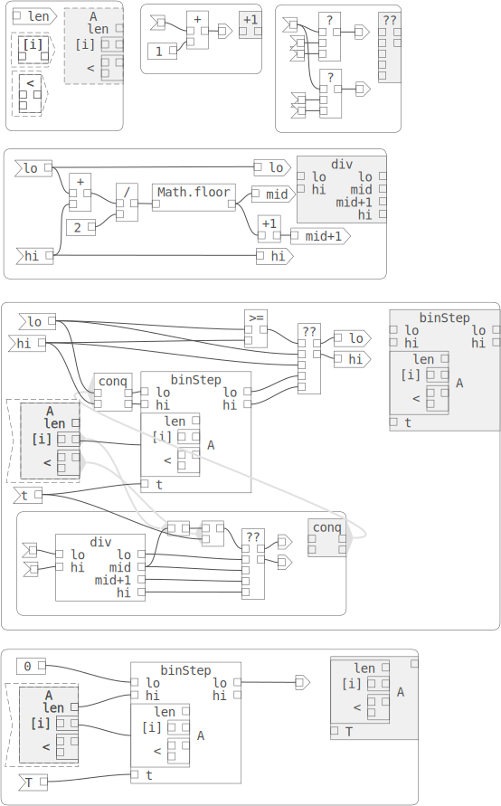
</figure>

This introduction shows how some illustrative programs can be built and discusses the advantages and potential of this approach.

For our purposes here, we implement a simple uni-type language which looks a lot like Javascript. We have primitive values (numbers, strings, etc.) and Functions. This simplifies our diagrams since we only have one kind of value and then functions flowing on our wires. However, we could extend these diagrams to include distinct primtive types with stronger typing to model languages like C, C++, Java, or Go.

## Simple Functions
We start by using the built-in functions provided by the language to create a new function.

Functions have input and output pins that can be wired to other functions. Input pins can only accept one wire at a time, while an output pin may fan out to multiple functions.

We also have pseudofunctions which look like functions in our diagrams, but don't calculate anything. One use of these is to allow us to specify inputs and outputs and name them.

The picture below is a simple example of a Functionchart to compute the signum function, which takes a single number x as input and returns 1 if x > 0, 0 if x = 0, or -1 if x < 0.

We can implement signum using built in functions:

1. pseudofunctions for the input, 'a', and the output, 'b'. The 'a' pseudo-function indicates that the same value is used in two different places and gives the input a name which appears on the new function type.
1. Literal functions (0, 1, -1), which have no inputs and output a literal primitive value.
1. Binary operators (<, >), which take two input values and output a boolean value.
1. The conditional operator (?), which takes an input value and two inputs. Its semantics are:
```ts
  if (input1)
    return input2
  else
    return input3.
```

The Functionchart is drawn with rounded corners to distinguish it from function instances in the diagram. In the top right corner is the function that is defined by the contents of the functionchart. It is shaded to indicate that it can be instanced. Tha means clicking on it and dragging and dropping creates a new instance of the function in the diagram.

The order of the function instance's inputs and outputs is determined by their vertical position in the functionchart. Inputs and outputs are sorted by their y-coordinate, so the topmost input in the functionchart becomes the first input in its function instance.

<figure>
  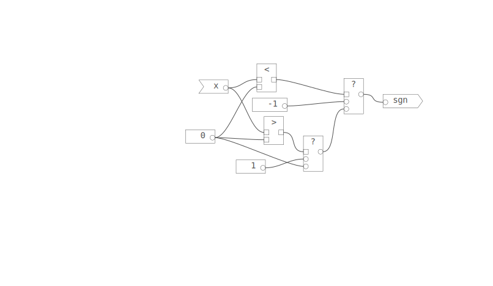
</figure>

This diagram is already a little hard to read. We can refactor, defining new helper functions. For the above example, we can define some very simple primitives (x<0, x>0, and a cascaded conditional operator) that make our function easier to read. Then we use the new functions to represent the final signum function as before. By default the sub-functions are drawn with lighter gray links to their defining functioncharts, as in this diagram. Normally we would set the links to be invisible for such simple helpers.

<figure>
  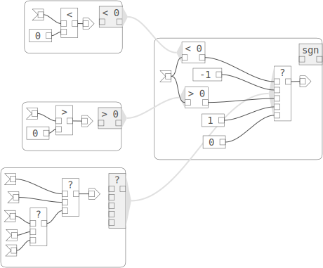
</figure>

Similarly we can define other useful functions. In this Functionchart, the function instance links are visible. We use the "< 0" function in the abs functionchart.

<figure>
  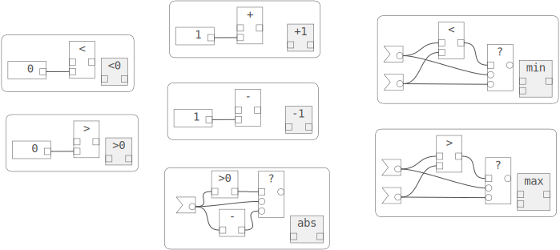
</figure>

## Implicit and Explicit Functioncharts

For very simple functions, we can specify that any open input and output pins will become inputs and outputs on the new function defined by the functionchart. Below, function 'a' is an implicit chained conditional operator, like we used for the signum function. The cond functions are arranged so that the inputs of the topmost one come before (y-order) the inputs of the second. The single disconnected output becomes the composed function's output.

If we set the 'implicit' property of the functionchart to 'false', then our composed function now has no inputs or outputs ('b'). In this case we need to explicitly add pseudofunctions to specify inputs and outputs. In 'c' we add the pseudofunctions, placing them so that they appear in the correct order (y-order). In 'd' we need a pseudo-function to specify that the same input goes to both cond functions. In general, explicit functioncharts give more control over naming, ordering, and routing inputs, but for simple functions they can contribute to clutter. In these cases, implicit is preferable.

In the diagram of simple functions above, all of the functioncharts are implicit, except where input pseudofunctions are needed to route the input to multiple functions.

<figure>
  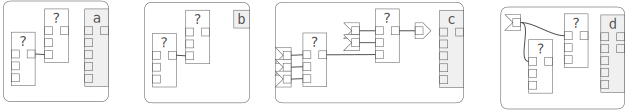
</figure>

## Recursion and Iteration

Since functions can call instances of themselves, we can define a recursive factorial (n!) function. This recursion is equivalent to an iteration, and in fact this is how functioncharts can represent iteration. Reading left to right, we define a helper decrement function, a "step" inner function, and finally an implicit functionchart which makes a single invocation of "step" with a pseudofunction input and 1 passed to the "acc" accumulator input.

<figure>
  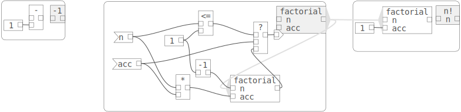
</figure>

The key features in this diagram are:

1. 'step' is carefully arranged to return the recursive function invocation as the last step to allow the "tail recursion" optimization.
1. The 'step' function can't be implicit because it is recursive. Implicit only works with non-recursive functions.
1. The final 'n!' functionchart is implicit to simplify the diagram.

Similarly, we can define a [Fibonacci](#Fibonacci) functionchart.

## Abstract Functions (Factorial)

Below is a functionchart that defines a more general iteration that can be used to implement factorial again.

Abstraction is an important technique for making software more useful. We can abstract this program a bit by changing the end value "1" with another input "end" and replacing the multiplication function with an abstract binary function 'f' that takes an index and an accumulator and returns some result. 'f' is a stand-in for a function to be provided by the caller, and just defines the shape or signature of the function.

We create a helper functionchart for 'f' which contains pseudofunctions for two inputs and one output. This makes the functionchart abstract, indicated by a dotted outline around its function instances. Abstract functions can be used just like any function inside a functionchart and are interpreted as an implicit input of a function.

In this example, we want to pass it to the inner functionchart, so we wrap it with an importer node. This converts the wrapped function into a function that produces instances of the wrapped function. It also allows us to create multiple instances from one input when that is desired.

This function now looks like a "reducer".

We can use 'reduce' to compute factorial by using an export function to pass the built-in multiplication function as "callback", and passing 1 as both the end index and the initial "acc" value.

<figure>
  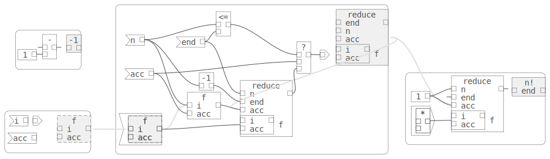
</figure>

This diagram is becoming hard to read. We can refactor to improve the diagram. Note that 'end' and 'f' inputs don't change during the iteration. We can move them out of the functionchart, and put them and the original into an enclosing functionchart. The inner functionchart closes over those external inputs, simplifying its signature. Then we can invoke the inner 'step' function in the parent functionchart to get our desired result.

<figure>
  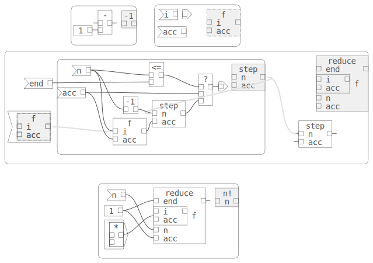
</figure>

We can also use the reduce function to sum the elements of an Array, if we are given a function that somehow contains an array and provides its length and an "indexer" function. We use the Array's indexer function in a small functionchart that uses the "i" parameter to get the i-th element of the array, and the "acc" parameter to add to the accumulator. This function is passed into reduce. This time, we set the initial "acc" to 0.

<figure>
  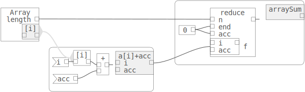
</figure>

## Abstract Functions (Binary Search)

Here is a binary search implementation. [Wikipedia](https://en.wikipedia.org/wiki/Binary_search)

```ts
function binary_search_leftmost(A: Array<number>, n: number, t: number) {
  let lo = 0;
  let hi = n;
  while (lo < R)  {
    const m = Math.floor((lo + hi) / 2);
    if (A[m] < t) {
      lo = m + 1;
    } else {
      hi = m;
    }
  }
  return lo;
}
```

In the functionchart below, judicious use of helpers gives a visual explanation of the index calculations, and keeps the wires organized. The inputs for our function will be a search value, and a indexer function '[i]' which maps an index to a value, exactly like in an array. We use an abstract indexer, so we can reuse this search function.

<figure>
  
</figure>

The key features in this diagram are:

1. Helper functions are defined first. The '??' predicate returns two separate values for the true and false cases. This helps organize related wires.

1. The 'divide' helper function divides the range [lo..hi] into two sub-ranges [lo..mid] and [mid + 1, hi]. This helps reduce clutter. It also provides a nice visual explanation of how the range is split, as the outputs are increasing as we read top to bottom.

1. The implementation is very general, taking an abstract indexer function '[i]' and "less than" function '<'.
1. A helper function 'test' is created using the indexer and less than function. This consumes the input parameters in one corner of the chart and replaces some long wires and links with a single instance link.

We can apply our 'search' function to an array-like abstraction. This provides a 'length' and an indexer function '[i]', making it effectively read-only to the 'search' function.

<figure>
  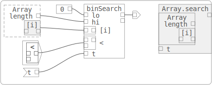
</figure>

## More General Iteration

We can define two basic iteration primitives, roughly corresponding to a do-while loop and a while-do loop. We begin by defining abstractions for the body of the loop, and the condition for continuing the iteration. We create abstract functioncharts for these. An abstract functionchart is one that contains only pseudofunctions and other abstract functions.

Each function takes a single input and produces a single output. 'do-while' and 'while-do' both take an initial value 'p' and simply pass it to the 'body' and 'cond' functions. This is our loop variable, corresponding to a numeric index or an iterator of some kind. It can be anything since we only forward it in the iteration functions. The result of 'body' is simply passed on to the next invocation of 'body'. 'body' is responsible for updating the loop variable and returning it. The result of 'cond' determines when the loop terminates. A true value continues the loop.

The do-while form runs 'body' before 'cond', by making 'cond' depend on the result of 'body'. The while-do runs 'cond' on the loop variable first, and only invokes 'body' if we iterate (call while-do recursively).

<figure>
  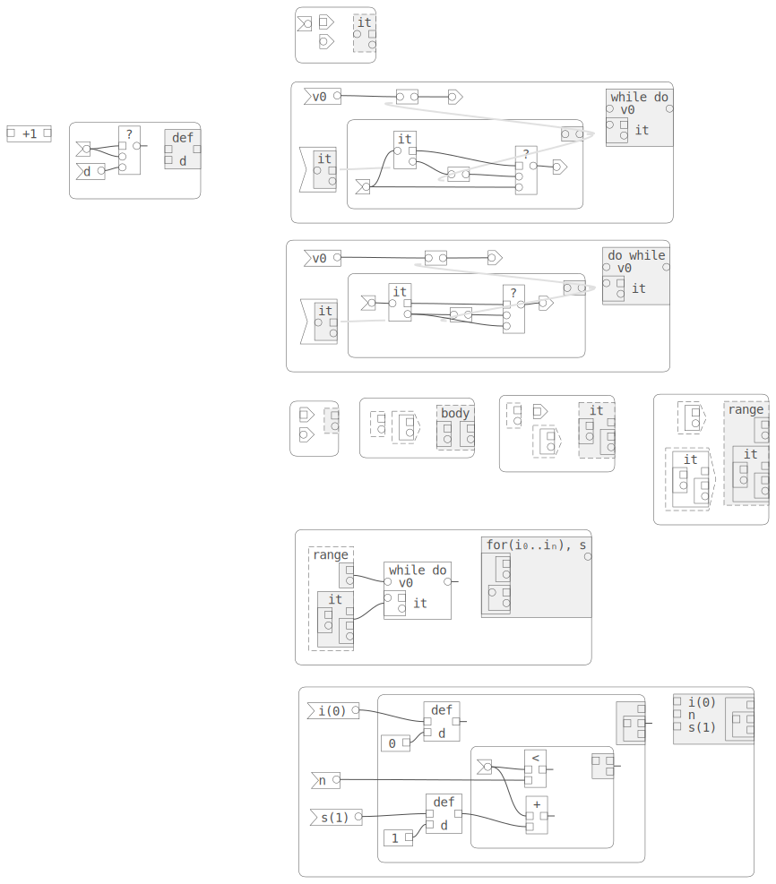
</figure>

If we make the iteration parameter a numeric index which the body and condition can test, then we can define for-loop primitives over a numeric range. Depending on the predicate chosen, we can implement various kinds of loops. Below we choose to implement the most common for-loops.

```ts
for (let i = start; i < end; )   // for [start,end[+

for (let i = start; i >= end; )  // for [start,end]-
```

At the bottom,= we again implement factorial using our for-loops. We choose the "down" iteration which iterates over the range [n..2] (inclusive).

Until now, our functions have all been pure, producing outputs and having no "side-effects". Now, we use a 'let' to hold our product as it's computed. 'let' represents a variable binding. We initialize the 'let' to 1 using the single input, and in our function 'body', multiply its value by the single input, changing the variable and returning the result to the iterator function.
<figure>
  
</figure>

## Representing State (swap)

The let function is a built-in variable binding that can hold a value. 'let' has a single input to initialize the value, and two outputs, one to return the current value, and a 'setter' function to change the value. This function takes a single input, the new value, and just returns that value.

We can create an abstract functionchart to represent a "stateful, mutable" value. We give this the same signature as 'let'.

Now we use a single 'let' as a temporary variable, and create a function that takes two input variables, and performs a swap between them. The function uses 'setter' functions to first set temp to the first input, then first to second, and finally second to temp. Orchestrating all of this is a 'use' pseudo-function, which takes a variable number of inputs. The inputs are evaluated in order, which does two things:

1. 'use' uses the input, which executes the source function - important when there are side-effects.
2. 'use' evaluates its inputs in order, providing a way to sequence functions that have side-effects.

Swap would be simpler to implement if the semantics of the setter were to return the old value. We might be able to avoid the 'use' pseudo-function. However, the old value is less useful in our function graphs than the new value, and this helps route values without long wires crossing the graph.

<figure>
  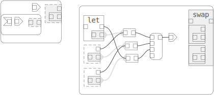
</figure>

## Abstract Functions (Quicksort)
Here is Javascript source for an implementation of Quicksort which does the partition step in place using Hoare's algorithm. [Wikipedia](https://en.wikipedia.org/wiki/Quicksort)

```ts
function quicksort(A: Array<number>, lo: number, hi: number) {
  if (lo >= 0 && hi >= 0 && lo < hi) {
    let p = partition(A, lo, hi);
    quicksort(A, lo, p);
    quicksort(A, p + 1, hi);
  }
}

// Divides array into two partitions
function partition(A: Array<number>, lo: number, hi: number) {
  let pivot = A[lo];
  let i = lo - 1;
  let j = hi + 1
  while (true) {
    do { i++ } while (A[i] < pivot);
    do { j-- } while (A[j] > pivot);
    if (i >= j) { return j; }
    let temp = A[i];
    A[i] = A[j];
    A[j] = temp;
  }
}
```

<figure>
  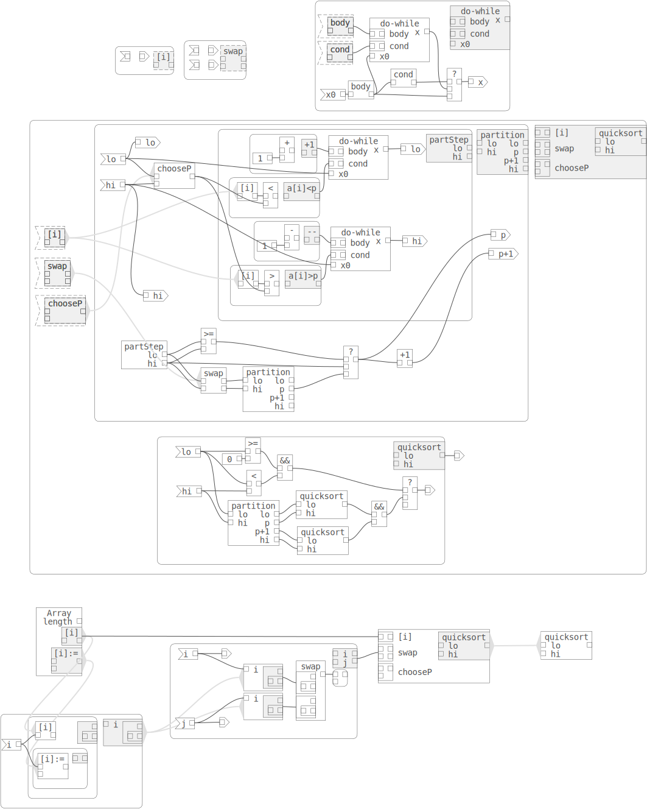
</figure>

The key features in this diagram are:

1. Abstractions for indexing ('[i]'), setting the pivot, and swapping ('swap') are defined first. These will make the quicksort generic.

1. (TODO, make the comparison functions generic.)

1. The generic functions are inputs in the outermost scope 'quicksort', but can be used in nested function definitions such as 'advToSwap', 'partition', and 'quicksort'. This simplifies the inputs and outputs of the helpers, reducing the number of wires. This is just like closure in Javascript.

1. The generic do-while function calls the abstract 'body' function until the abstract 'cond' function returns false. The body function takes 1 input parameter and returns 1 output. The do-while function passes the body result to the cond function to perform the loop test. If it's true, do-while calls itself recursively, passing the result of body in to itself. If false, then the result of body is returned. Thus, do-while returns the result of the last call to body. Note that body must execute before cond, since it's "upstream" from it.

1. 'quickStep' doesn't return a meaninful result (it's true if sorting happened, otherwise undefined if we return.) However, the result is important, since it drives the execution. This is important because this quicksort has important side effects.

1. Finally, 'quicksort' defines a function that takes in the generic function parameters and returns a function to sort given a length.

TODO text for quicksort application.

<figure>
  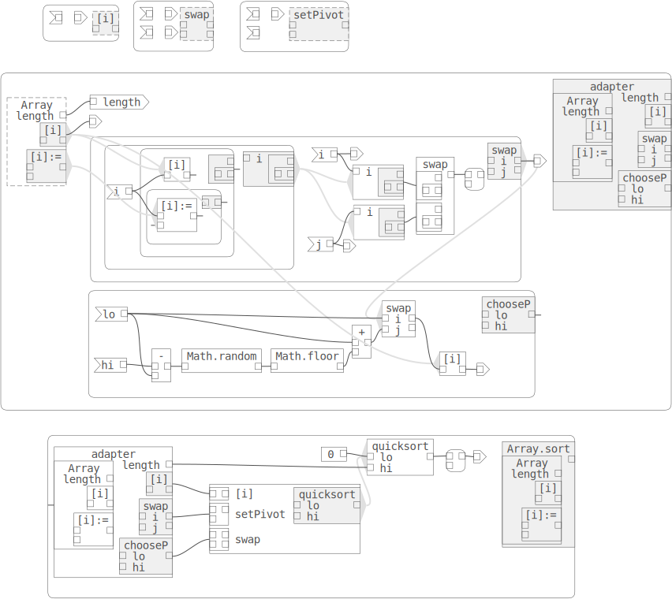
</figure>

## Stateful Iteration (Counters)
Minimal iteration abstraction
<figure>
  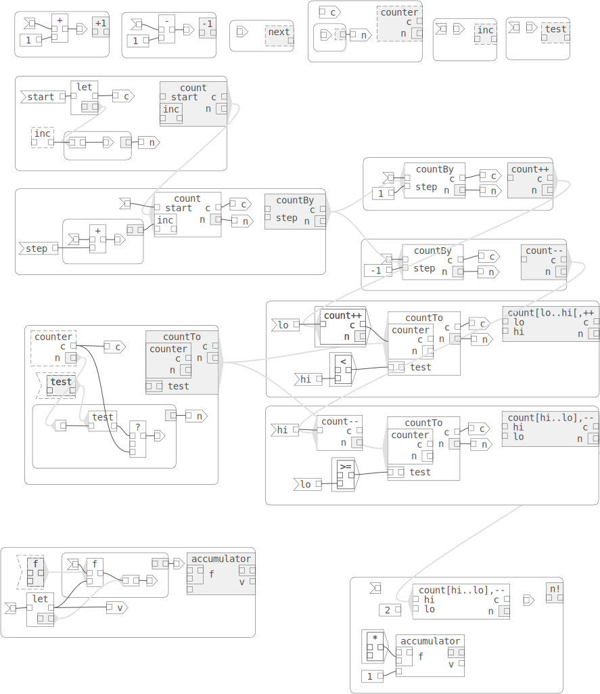
</figure>


## Representing State (Tuples)

<figure>
  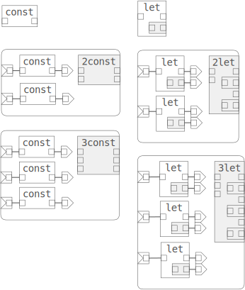
</figure>

## Representing State (Point types)
While it might seem that Functioncharts are a purely higher-order functional language, we can define functions with side effects, which allow us to support programming paradigms like regular imperative programming and Object Oriented Programming.

Below, we define a function V representing a vector of numbers in 2 dimensions. Using a special 'this' element, we define properties 'x' and 'y' which the function adds to the 'this' object. 'this' functions have a simple value output for the current value of the property, and a setter function which has the side effect of changing the bound value. We don't define how 'this' is created yet. The V function returns two new functions, one to retrieve both properties and the other to set the two properties.

Below this function we create a function VNormal representing a subtype function which represents only normalized (length 1) vectors. This function calls the V function, which initializes the 'x' and 'y' properties. However, VNormal first normalizes the two coordinates before calling the V function so it is initialized properly. It also overrides the V setting function to first normalize the coordinates before calling the base setter function. In other words, it overrides its base type's function.

<figure>
  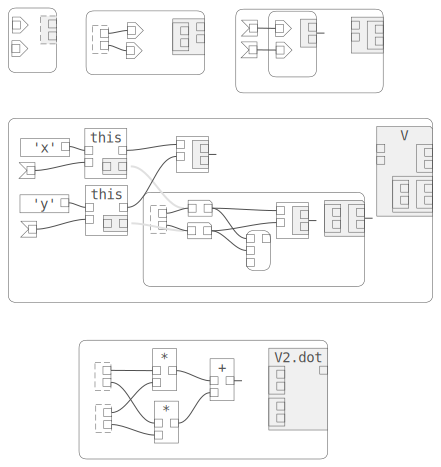
</figure>

## Libraries

<figure>
  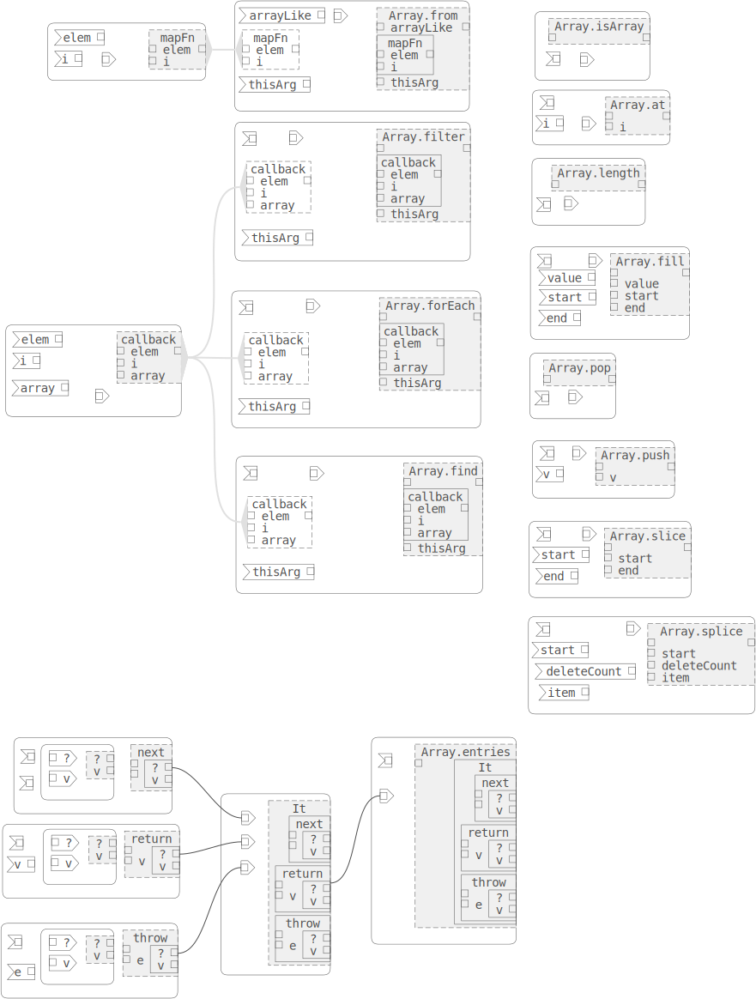
</figure>


## Semantics

1. To evaluate a function, evaluate its inputs.
1. For each output of the function, trace back to recursively evaluate. If a 'cond' is encountered, evaluate the condition, then the branch that will be the result.

# More Examples

## Fibonacci

Similarly to the recursion example, we can define a Fibonacci function. We define a helper which takes 3 parameters, and then "call" it with n, 1, 1, to start the iteration.

<figure>
  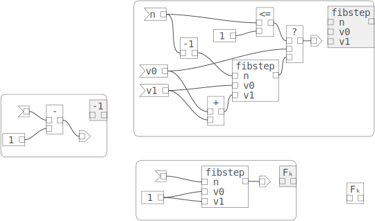
</figure>

## Exponentiation by Squaring

We can define an efficient exponentiation function. [Wikipedia](https://en.wikipedia.org/wiki/Exponentiation_by_squaring)

```ts
function exp_by_squaring(x: number, n: number) {
  return exp_by_squaring2(1, x, n)
}
function exp_by_squaring2(y: number, x: number, n: number) : number {
  else if (n == 0) return y;
  else if (n & 1 === 0) return exp_by_squaring2(y, x * x, n / 2);
  else return exp_by_squaring2(x * y, x * x, (n - 1) / 2);
}
```

We create some simple helper functions to test for zero and even, and a two condition operator. We also create an expStep helper function to implement the recursion. Again, this function is arranged to call itself recursively as the last step, allowing the tail-recursion optimization.

<figure>
  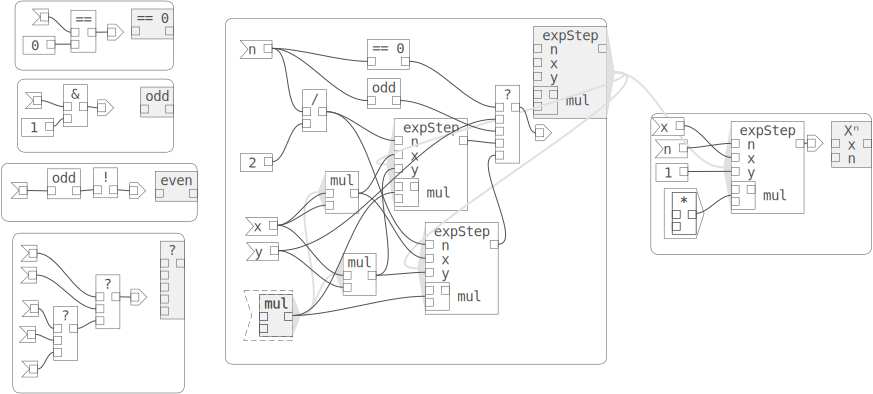
</figure>

The functionchart is hard to understand, with a tangle of wires crossing in the middle. Functioncharts can be refactored. Here we do take the core step that computes the new x, y from the inputs and use a functionchart to create a helper function. We also reorder the 'n', 'y', and 'x' inputs to minimize crossings. The use of hierarchy has the effect of removing a part of the circuit and creating an indirection when we instantiate the single instance. The helper function gives a visual explanation of the core multiply step.

<figure>
  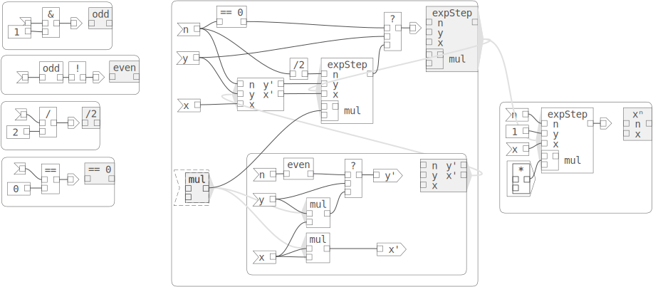
</figure>

## Covariance (fewer inputs), Contravariance (more outputs)
TODO

## Stateful Iteration Protocols
TODO

## Iteration over a Numeric Range
We can make iteration more generic. First we define an abstract "body" function, with 1 input and 1 output. The first input is the iteration index, the typical "i" in a for-loop. The output is the result of the body, and is used by the iteration function to break. We choose "undefined" as the sentinel value to break. Then we iterate over the range [0..n[, passing the index to the body function and continuing as long as the body returns a defined value.

We can use the iteration to implement our factorial function. However, since we don't have an accumulator passed as a parameter to our body function, we must instead encapsulate that in the body function as a bit of state. We do this now by using a 'var' element, which has two outputs - the first returns the current value, and the second returns a function which changes the value, and returns the previous value. Then our body function multiplies the current value by the iteration index, then sets the var to the result. We also return the value, so we continue rather than breaking from the iteration.
<!-- <figure>
  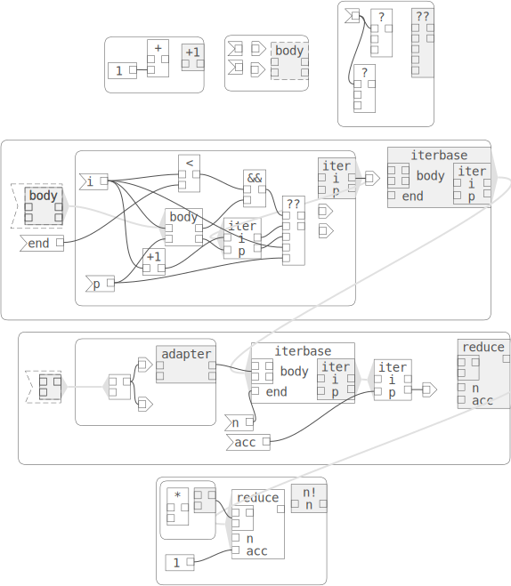
</figure> -->

## More General Iteration over a Range
Generic iteration with start, end, condition, and step configurable.
TODO up/down, step 1, n, exotic step (binary search)
<figure>
  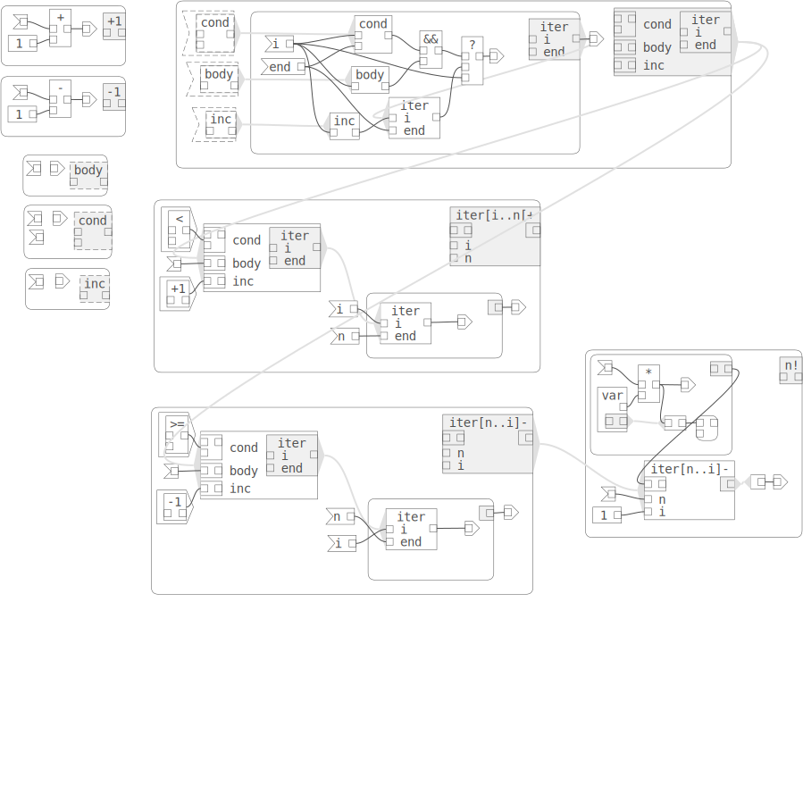
</figure>

## Live Demo Editor with Examples
Our palette contains the built in functions and Pseudofunctions. On the top are the input, output, apply, and pass Pseudofunctions. input and output allow us to explicitly label inputs and outputs and indicate how an input feeds into the circuit. apply connects to a function output of an function and allows us to instantiate that function in the containing circuit. pass takes its input and passes it on, allowing us to add sequencing ability to our circuits.

<!-- <figure>
  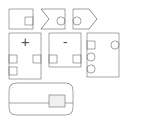
</figure> -->

[Live Demo](https://billbudge.github.io/WebEditorFramework/examples/functioncharts/)

## Inspiration
Functioncharts were inspired by Harel Statecharts, another graphical representation of programs, which employs hierarchy to give state-transition diagrams more expressive power.

<figure>
  
</figure>
