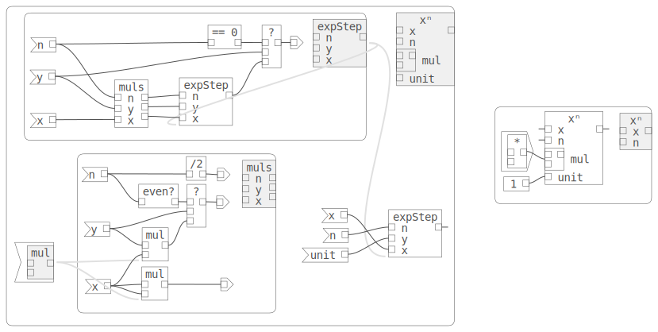
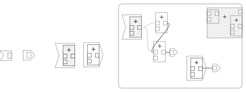
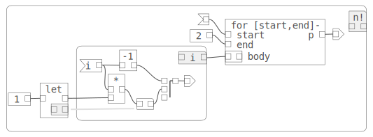
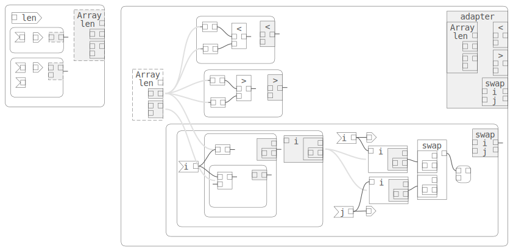
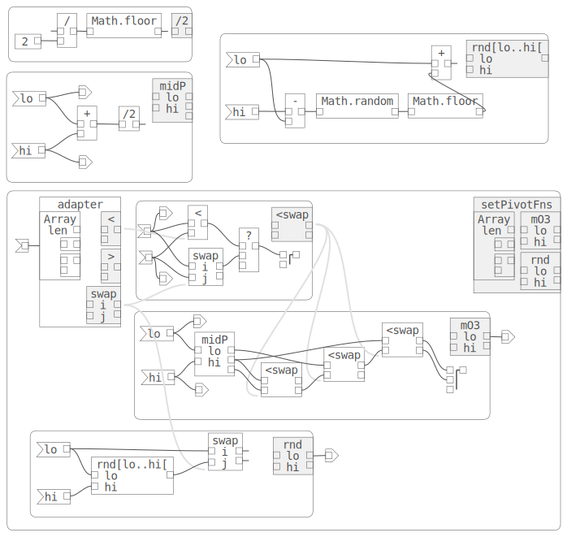
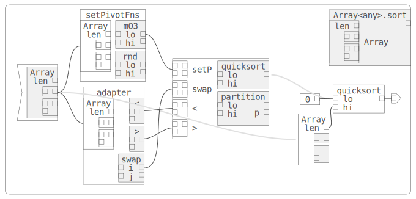
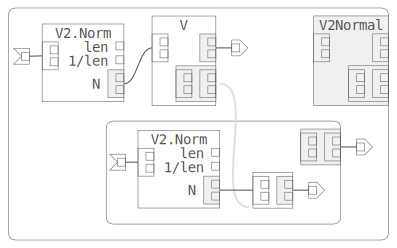
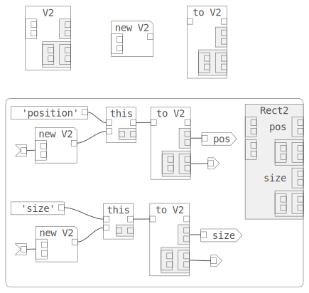
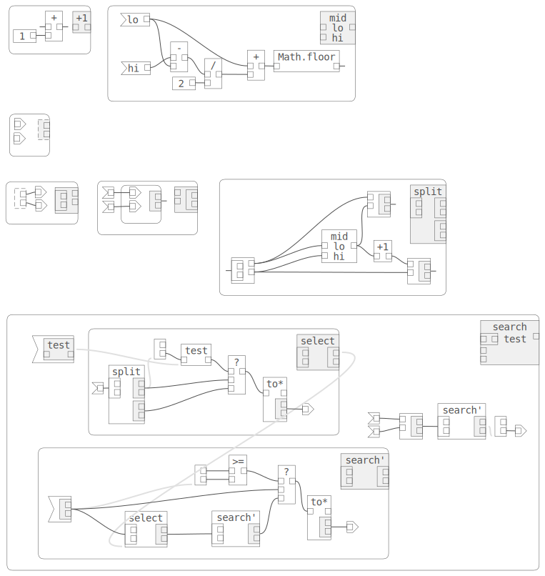
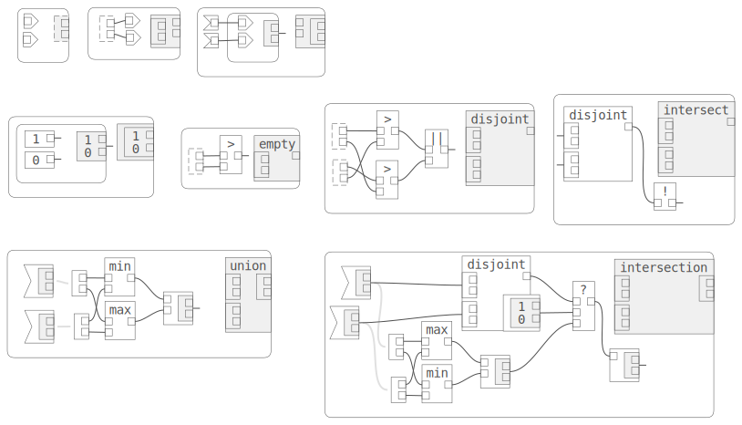

# Functioncharts: A Graphical Programming Language
Functioncharts are a graphical programming language, using a "node and wire" graph to represent programs. This repository contains the source code for a Web application that runs in a browser and can create Functionchart graphs. There is no support yet for compiling, executing and debugging these programs (but that would be a good project!) The emphasis here is on the design of the language. The web application is currently just a very specialized diagram editor.

Functioncharts are inspired by [Statecharts](../statecharts/README.md). "Flowcharts" would have been a great name for these, but that name is taken. (Edit: The Functionchart name is also taken.)

Many "node and wire" programming systems have been built. However, most are either domain-specific, or are targeted at non-programmers. The audacious goal here is for Functioncharts to be equivalent in expressiveness and power to conventional textual programming languages. Like Statecharts, Functioncharts use hierarchy and abstraction to increase the power and economy of the notation.

The two principal innovations in Functioncharts are:

1. Functions can accept other functions as inputs, and produce new functions as outputs. This gives the diagrams much greater expressive power.

1. Functions define scopes, and a function can be used inside its own scope. This allows us to naturally express recursion and iteration. Function scopes can be nested, and may define complete functions, or partial functions, allowing us to create closures.

These two features can reduce the visual complexity of the Functionchart diagrams, by making it easy to produce and consume  functions. They can also organize the diagram, reducing the number and complexity of the wires.

Here is an example, implementing the [exponentiation by squaring algorithm](https://en.wikipedia.org/wiki/Exponentiation_by_squaring). This example is generic, applying to any type where multiplication can be applied (e.g. numbers, complex numbers, polynomials, and matrices). A specialization of the generic function for numbers is on the right.

<figure align="center">
  
</figure>

This introduction shows how some illustrative programs can be built and discusses the advantages and potential of this approach.

For our purposes here, we implement a simple uni-type language which looks a lot like Javascript. We have primitive values (numbers, strings, etc.) and Functions. This simplifies this diagrams since we only have one kind of value and then functions flowing on our wires. However, we could extend these diagrams to include distinct primtive types with stronger typing to model languages like C, C++, Java, or Go.

## Simple Functions
We start by using some of the built-in functions provided by the language to create a new function.

Functions have input and output pins that can be wired to other functions. Input pins can only accept one wire at a time, while an output pin may fan out to multiple functions.

We also have pseudofunctions which look like functions in this diagrams, but don't calculate anything. One use of these is to allow us to specify inputs and outputs and name them.

The picture below is a simple example of a Functionchart to compute the signum function, which takes a single number x as input and returns 1 if x > 0, 0 if x = 0, or -1 if x < 0.

We can implement signum using built in functions:

1. pseudofunctions for the input, 'a', and the output, 'b'. The 'a' pseudo-function indicates that the same value is used in two different places and gives the input a name which appears on the new function type.
1. Literal functions (0, 1, -1), which have no inputs and output a literal primitive value.
1. Binary operators (<, >), which take two input values and output a boolean value.
1. The conditional operator (?), which takes an input value and two inputs. Its semantics are:
```ts
  if (input1)
    return input2
  else
    return input3
```

The Functionchart is drawn with rounded corners to distinguish it from function instances in the diagram. In the top right corner is the function that is defined by the contents of the functionchart. It is shaded to indicate that it can be instanced. That means clicking on it in the editor and dragging and dropping creates a new instance of the function in the diagram.

The order of the function instance's inputs and outputs is determined by their vertical position in the functionchart. Inputs and outputs are sorted by their y-coordinate, so the topmost input in the functionchart becomes the first input in its function instance. This is a simple way to allow the user to control the order of function inputs and outputs on the instances of the functionchart.

<figure align="center">
  
</figure>

This diagram is already a little hard to read. We can refactor, defining simple helper functions. For the above example, we can define some primitives (x<0, x>0, and a cascaded conditional operator) that make our function easier to read. Then we use the new functions to represent the final signum function as before. By default the sub-functions are drawn with lighter gray links to their defining functioncharts, as in this diagram. Normally we would set the links to be invisible for such simple helpers.

<figure align="center">
  
</figure>

Key diagram features:
1. The cascaded conditional function is carefully arranged in y-order to be equivalent to:
```ts
  if (input1)
    return input2
  else if (input3)
    return input4
  else
    return input5
```

Similarly we can define other useful functions. In this Functionchart, the function instance links are visible. We use the "< 0" function in the abs functionchart.

<figure align="center">
  
</figure>

## Implicit and Explicit Functioncharts

For very simple functions, we can specify that any open input and output pins will become inputs and outputs on the new function defined by the functionchart. Below, function 'a' is an explicit chained conditional operator. The input and output pseudofunctions are arranged so that the inputs of the topmost one come before (y-order) the inputs of the second. The single  output becomes the composed function's output.

If we set the 'implicit' property of the functionchart to 'false' and leave the 'cond' functions disconnected, then our composed function now has no inputs or outputs ('b'). In 'c' we set 'implicit' to true. The 'cond' functions are placed so that the pins are in the correct order. In 'd' we create a slightly different parallel 'cond', with two outputs, and each case has two inputs. We need a pseudo-function to specify that the same value goes to both 'cond' functions selector input. In general, explicit functioncharts give more control over naming, ordering, and routing inputs, but for simple functions they can contribute to clutter. In these cases, implicit is preferable.

In the diagram of simple functions at the beginning, all of the functioncharts are implicit, except where input pseudofunctions are needed to route the input to multiple functions.

There is one case where 'implicit' isn't allowed - recursive functioncharts. We'll see those next.

<figure align="center">
  
</figure>

Key diagram features:
1. (a) Explicit cascaded conditional.
1. (b) Explicit function with conditionals, but no input or output pins. The empty function.
1. (c) Implicit cascaded conditional.
1. (d) Implicit parallel conditional, to return two results gated on a single condition. Note how the position of the built-in conditional functions interleave the inputs and outputs in the desired way.

## Recursion and Iteration

Since functions can call instances of themselves, we can define a recursive factorial (n!) function. This recursion is equivalent to an iteration, and in fact this is how functioncharts can represent iteration. Reading left to right, we define a helper decrement function, a 'step' inner function, and finally an implicit functionchart which calls 'step' passing a litereal '1' to the 'acc' accumulator input.

<figure align="center">
  
</figure>

Key diagram features:
1. 'step' is carefully arranged to return the recursive function invocation as an input to the last function 'cond' to allow the "tail recursion" optimization.
1. The 'step' function can't be implicit because it is recursive. Implicit only works with non-recursive functions.
1. The final 'n!' functionchart is implicit to simplify the diagram.

Similarly, we can define a [Fibonacci](#Fibonacci) functionchart.

## Abstract Functions (Factorial)

Below is a functionchart that defines a more general iteration and uses that to implement factorial again.

Abstraction is an important technique for making software more useful. We can abstract this program by changing the literal  value '1' with an input 'end' and replacing the built-in multiplication with an abstract binary function 'f' that takes an index and an accumulator and returns some result. 'f' will represent a function to be provided by the caller.

To define the shape or signature of our abstract function 'f', we define an abstract functionchart. Any functionchart
with no wires is considered abstract. The one defining 'f' contains pseudofunctions for two inputs and one output. Abstractness is represented by a dotted outline. Abstract functions can be used just like any function inside a functionchart and are interpreted as an implicit input of the function being defined.

In this example, we use the function, but also pass it to the inner functionchart, so we need to modify the abstract function. The "importer" modifier contains the inner function and presents it as an output. This allows us to create instances of the wrapped function, which we do here, and also to wire the function to other functions as an input. We do that to pass 'f' to 'reduce'.

We can use 'reduce' to compute factorial. We use an exporter modifier to pass the built-in multiplication function as 'f', and passing 1 as both the 'end' index and the initial 'acc' value.

<figure align="center">
  
</figure>

Key diagram features:
1. We define an abstract function type 'f'.
1. We make our iteration function 'reduce' more general.
1. To implement n! we call reduce with literal '1' for 'end' and 'acc', and the built-in '*' for 'f'. To pass a function as a parameter, we wrap it in an "exporter" modifier.

## Closure and Default Values

The diagram above is becoming hard to read. We can refactor to improve the diagram. Note that 'end' and 'f' inputs don't change during the iteration. We can move them out of the functionchart, and put them and the original into an enclosing functionchart. The inner functionchart "closes" over those external inputs, simplifying its signature. Then we can invoke the inner 'step' function in the parent functionchart to get our desired result.

In the next version, we give the 'acc' and 'f' inputs default values. For a simple value type, the 'input' pseudofunction specifies that "acc = 1". For the function input, instead of an abstract 'f', we modify the * operator to become an importer. The semantics of this are that if no function is passed in, we use the inner function which in this case is the built-in *.

<figure align="center">
  
</figure>

We can use this more general 'reduce' function to sum the elements of an Array, if we are given a function that somehow contains an array and provides its length and an "indexer" function. We use the Array's indexer function in a small functionchart that uses the 'i' parameter to get the i-th element of the array, and the 'acc' parameter to add to the accumulator. This function is passed into reduce and overrides the default '*'. We override the default value of 'acc' to be 0.

<figure align="center">
  
</figure>

## Modifiers

Modifier functions extend the functionchart notation for things that are cumbersome or impossible to represent without them. For example, how do we convert a function into an output that can be connected to an input? Similarly, how do we import a function as an input?

Above we saw the importer and exporter modifiers, which convert a function 'F' into a function that outputs 'F'. These are interpreted differently in functioncharts. Importers become implicit inputs in a functionchart. Exporters must be explicitly connected to be an output.

<figure align="center">
  
</figure>

Key diagram features:
1. Empty import and export modifiers (left). By default they contain the empty function.
1. The effect of importers and exporters in a functionchart. This function takes a binary function, by default the built-in '+' operator. It uses this function to perform a nonsensical operation which returns NaN, and exports the '+' built-in as an output.

## Abstract Functions (Binary Search)

This code is a simple binary search implementation. [Wikipedia](https://en.wikipedia.org/wiki/Binary_search)

```ts
function binary_search_leftmost(A: Array<number>, n: number, t: number) {
  let lo = 0;
  let hi = n;
  while (lo < R)  {
    const m = Math.floor((lo + hi) / 2);
    if (A[m] < t) {
      lo = m + 1;
    } else {
      hi = m;
    }
  }
  return lo;
}
```

In the functionchart below, the helper function 'divide' gives a visual explanation of the index calculations, and keeps the wires organized. The inputs for our function will be a search value, and a indexer function '[i]' which maps an index to a value, exactly like in an array. We use an abstract indexer, so we could use this search function on anything which looks like an array.

<figure align="center">
  
</figure>

Key diagram features:

1. Helper functions are defined first. The parallel '??' predicate returns two separate values for the true and false cases. This helps organize related wires.
1. The 'divide' helper function divides the range [lo..hi] into two sub-ranges [lo..mid] and [mid + 1, hi]. This helps reduce clutter. It also provides a nice visual explanation of how the range is split, as the outputs are increasing as we read top to bottom.
1. The implementation is very general, taking an abstract indexer function '[i]' and "less than" function '<'.
1. A helper function 'test' is created using the indexer and less than function. This consumes the function inputs and the search target 't' in one corner of the diagram and replaces some long wires and links with a single instance link.
1. Finally, 'binSearch' calls the 'search' function on the input range.

We can apply our 'binSearch' function to an array-like abstraction. This provides a 'length' and an indexer function '[i]', making it effectively read-only to the 'search' function.

<figure align="center">
  
</figure>

## More General Iteration

We can define two basic iteration primitives, corresponding to a do-while loop and a while-do loop. We begin by defining abstractions for the body of the loop, and the condition for continuing the iteration. We create abstract functioncharts for our 'body' and 'test' functions.

Each function takes a single input and produces a single output. 'do-while' and 'while-do' both take an initial value 'p' and simply pass it to the 'body' and 'cond' functions. This acts as a loop variable, corresponding to a numeric index or an iterator of some kind. It can be anything since we only forward it in the iteration functions. The result of 'body' is simply passed on to the next invocation of 'body'. 'body' is responsible for updating the loop variable and returning it. The result of 'cond' determines when the loop terminates. A true value continues the loop.

The do-while form runs 'body' before 'cond', by making 'cond' depend on the result of 'body'. The while-do runs 'cond' on the loop variable first, and only invokes 'body' if we iterate (call while-do recursively). This gives the desired semantics.

<figure align="center">
  
</figure>

If we make the iteration parameter a numeric index which the body and condition can test, then we can define for-loop primitives over a numeric range. These specialized loops implement the 'test' function but leave 'body' undefined. Depending on the predicate chosen, we can implement various kinds of loops. Below we choose to implement the most common for-loops.

```ts
for (let i = start; i < end; )   // for [start,end[, +

for (let i = start; i >= end; )  // for [start,end], -
```

<figure align="center">
  
</figure>

Until now, our functions have all been pure, producing outputs and having no side effects. We need some state to represent an "accumulator" if we want to use these iteration primitives for our factorial function.

We use a 'let' function, which represents state as a variable binding. It will hold our product as it's computed. We initialize this 'let' to a literal '1' using the single input, and in our function 'body', multiply its current value (the first 'let' output) by the input to our body function, using the output "setter" function to update the variable and returning the result to the iterator function.

Side effects introduce a complication. We may want to get the side effect without consuming a result. To drive the side effects, we use the 'use' pseudofunction.

<figure align="center">
  
</figure>

## Representing State (swap)

The 'let' function is a built-in variable binding that can hold a value. It's single input initializes the value, and it has two outputs, one to return the current value, and a 'setter' function to change the value. This function takes a single input, the new value, and just returns that value. Because it has side effects, it is rendered with a notch at the top right. (TODO render function instances with side effects with the notch.)

To make our swap generic, we can create an abstract 'let' like function to represent a general binding. This function has the same signature as 'let'.

Now we use an actual 'let' as a "temp" variable, and create a function that takes two bindings as input, and performs a swap between them. Below are two ways it can be implemented.

The 'swap1' function initializes the 'let' to the first input's value. It also calls the setters for the inputs to set the first to the second's value, and the second to the "temp" value. Sequencing all of this is a 'use' pseudo-function, which takes a variable number of inputs. The inputs are evaluated in order, which does two things.

The 'swap2' function doesn't initialize the 'let'. Instead, it calls the setters for the "temp" and inputs in the desired order, again sequenced by the 'use'.

1. 'use' uses the input, which executes the source function - important when there are side-effects.
2. 'use' evaluates its inputs in order, providing a way to sequence functions that have side-effects.

Swap would be simpler to implement if the semantics of the setter were to return the old value. We would be able to avoid the 'use' pseudo-function. However, the old value is less useful in our function graphs than the new value. Forwarding input values is a surprisingly effective way to avoid long wires crossing the graph.

<figure align="center">
  
</figure>

Key diagram features:
1. The 'use' guarantees execution in the correct order.
1. The 'let' can be initialized before use, or left uninitialized.

## Abstract Functions (Quicksort)
Here is Typescript source for an implementation of Quicksort which does the partition step in place using Hoare's algorithm. [Wikipedia](https://en.wikipedia.org/wiki/Quicksort)

The code is subtle. In particular, it requires the element used for the pivot is at the 'lo' index. Because of this, the do-while loops in 'partition' don't need to check i, j against lo, hi while iterating.

```ts
function quicksort(A: Array<number>, lo: number, hi: number) {
  if (lo >= 0 && hi >= 0 && lo < hi) {
    let p = partition(A, lo, hi);
    quicksort(A, lo, p);
    quicksort(A, p + 1, hi);
  }
}

// Divides array into two partitions
function partition(A: Array<number>, lo: number, hi: number) {
  let pivot = A[lo];
  let i = lo - 1;
  let j = hi + 1
  while (true) {
    do { i++ } while (A[i] < pivot);
    do { j-- } while (A[j] > pivot);
    if (i >= j) { return j; }
    let temp = A[i];
    A[i] = A[j];
    A[j] = temp;
  }
}
```

<figure align="center">
  
</figure>

Key diagram features:

1. An abstraction for swapping elements at indices (i, j). It has two index inputs. This swaps the elements at i and j, and returns the input parameters for convenience.
1. An abstraction 'setP' for setting the pivot for the range [lo..hi]. Similarly, it takes two indices and simply returns them.
1. Binary predicates for comparing the elements at (i, j). This takes two indices and returns a boolean result.
1. Note that array is accessed only indirectly, through indices.
1. The abstract functions are inputs in the outermost scope, but are used in nested functioncharts such as 'advToSwap', 'partition', and 'quicksort'. The outermost functionchart takes these inputs and returns the functions 'quicksort' and 'partition'.
1. The first function 'quicksort' doesn't return a meaningful result (always 'true' because we return the result of the termination check.) However, the result must be consumed, since it drives the execution. This is important because this quicksort is all about side effects.
1. The second function 'partition' finds the point where the pivot element divides the range into two. It returns this 'p', and the input parameters, which is convenient for the 'quicksort' diagram. We return 'partition' as a result function since it is useful on its own.
1. The third, 'advToSwap' uses do-while to advance the pointers. Note that 'lo' is passed to '<' and '>' since these compare to the pivot, which is at 'lo'.

## Calling Quicksort

In order to call 'quicksort', we must create the functions 'swap', 'setP', '<', and '>'. We could do this, given an array. Again we choose to create an abstraction, this time for an Array-like function. The abstraction has a 'length', an indexed getter, and an indexed setter. This looks similar to a 'let', except that the additional index parameter is needed by both get and set.

We create an adapter which adapts the array abstraction to the required 'swap' and predicate functions, then use the adapter to implement two pivot selection algorithms, one a random element in the range, and the other a median-of-3 implementation. Finally, we use our adapter and pivot functions to call quicksort.

<figure align="center">
  
</figure>

Key diagram features:

1. The 'adapter' function uses the array indexed getter to implement the comparison functions.
1. It also uses the getter and setter to create a function that maps an index into a let-like function, which can be passed to the 'swap' we implemented above. That swap is used to implement the array swap function that quicksort requires. The output isn't needed, but we must 'use' it to drive the side effects.

<figure align="center">
  
</figure>

1. We use the adpater to implement two pivot selection algorithms.
1. The adapter is useful since it implements 'swap', and the pivot functions in general swap the selected pivot with the element at 'lo'.
1. We implement a random pivot 'rnd', and "median of 3" pivot 'mO3', intended to make the pathological quicksort behavior much less likely.

Code fragment for Median of the 3 elements at 'lo', 'mid', and 'hi'.
```ts
mid := ⌊(lo + hi) / 2⌋
if A[mid] < A[hi]
    swap A[hi] with A[mid]
if A[lo] < A[hi]
    swap A[hi] with A[lo]
if A[mid] < A[lo]
    swap A[mid] with A[lo]
pivot := A[lo]
```

<figure align="center">
  
</figure>

1. We call 'quicksort' on our abstracted array, using the adapter, and choosing the "median-of-3" pivot function.

## Object Oriented Programming (2D Vectors)

Below we program a 2D Vector type. We would like to pass the "x, y" values with just one wire, so we first define an abstract pair type to represent inputs and outputs on vector operations.

We also define two adapter functions. The first "1-to-2" converts a pair into the two components. The second "2-to-1" does the opposite. It may be surprising but these adapter functions are not abstract - they perform a real transformation on their inputs.

There is a difficulty though. What if we only want to change a single component of a vector? We don't want to always have to pass another value in this case, so we define some helper functions to check for an undefined component before setting. Then we can call the setter with 0, 1, or 2 values and get the desired effect (0 = no effect, 1 = set x or y, 2 = set x and y).

Now to the V2 constructor function.

Using the built-in 'this' function, we define member properties 'x' and 'y' which the function adds to the 'this' object. Similarly to 'let', the 'this' function has a value output for the current value of the property, and a setter function which has the side effect of changing the bound value. It has an input for the property name, and one for the initial value. We'll show where the "this" reference comes from below when we cover object composition.

V2 accepts a pair as input, and passes the values to initialize the 'x' and 'y' member properties.

V2 returns getter and setter functions, like any bound value, but working on pairs. The getter uses our 2-to-1 adapter to pass the bound values as a result function. The setter uses our helper functions to conditionally call the two setters, and the 2-to-1 adapter to combine the results.

We also define some "free" functions to operate on vectors. These aren't member functions - they can be used on anything that looks like a pair of numbers. We define 'V2.dot', 'V2.scale', and 'V2.Norm' in the usual way.

<figure align="center">
  
</figure>

## Subclassing (Normalized 2D Vectors)

Subclassing works by embedding the "super" function in the "subclass" function. Below, we create a function 'VNormal' representing normalized (length == 1) vectors. This function contains a call to the V function, which initializes the 'x' and 'y' properties. However, VNormal first uses V2.Norm to normalize the input pair before calling the V function so it is initialized properly. Similarly, it "overrides" the V2 setter by first normalizing the coordinates before calling the base setter function. Thus, V2Normal values are always normalized.

<figure align="center">
  
</figure>

## Composition (2D Rectangle from Vectors)

Composition works by binding values of another type in a new constructor function. Below, we define a 2D Rectangle type by using 'this' functions to bind two instances of V2. This is done using the 'new' modifier, which converts a function into an object creation call. The 'new' modifier has the same inputs as the contained constructor function, but just a single output, a reference to the "this" object holding the constructed object. That makes it easy to pass the value to a 'let' or 'this' function to bind it.

The first row below shows a V2 function instance, then modified as 'new V2', and finally a 'cast' modifier, which takes a value input and returns the V2 outputs, so we can use the new bound instance.

Rect2 defines 'position' and 'size' member properties, initializes them with the two input pairs, and returns two getters and two setters. This is a very simple composition, but we could have more complex adaptations and constraints.

<figure align="center">
  
</figure>

## Cast Modifiers
TODO down-casting, up-casting. There is a lot to explain here.

## Libraries

Below is an abstract description of an Array library, patterned after Javascript's Array object.

<figure align="center">
  
</figure>

## Semantics TODO

1. To evaluate a function in a context, determine which outputs are consumed.
1. For each consumed output of the function, trace back to evaluate (cache results, so each function is evaluated only once). If a 'cond' is encountered, evaluate the condition, then evaluate along the branch that will be the result.
1. This "lazy" evaluation is not for efficiency; it is needed when side-effects are desired only under certain conditions.
1. 'use' pseudofunctions can be used to pull in side-effects, and to order function evaluation. A 'use' whose output is disconnected is always evaluated. A 'use' whose output is connected is only evaluated if its value is consumed. This allows conditional side effects. The value of this 'use' is the first input. TODO example

# More Examples

## Fibonacci

Similarly to the recursion example, we can define a Fibonacci function. We define a helper which takes 3 parameters, and then "call" it with n, 1, 1, to start the iteration.

<figure align="center">
  
</figure>

## Exponentiation by Squaring

We can define an efficient exponentiation function. [Wikipedia](https://en.wikipedia.org/wiki/Exponentiation_by_squaring)

```ts
function exp_by_squaring(x: number, n: number) {
  return exp_by_squaring2(1, x, n)
}
function exp_by_squaring2(y: number, x: number, n: number) : number {
  else if (n == 0) return y;
  else if (n & 1 === 0) return exp_by_squaring2(y, x * x, n / 2);
  else return exp_by_squaring2(x * y, x * x, (n - 1) / 2);
}
```

We create some simple helper functions to test for zero and even, and a two condition operator. We also create an expStep helper function to implement the recursion. Again, this function is arranged to call itself recursively as the last step, allowing the tail-recursion optimization.

<figure align="center">
  
</figure>

The tangle of wires crossing in the middle makes this virtually impossible to read. We can refactor to fix this.

Here we take the core step that computes the new x, y from the inputs and use a functionchart to create a helper function. We also reorder the 'n', 'y', and 'x' inputs to minimize crossings. The use of hierarchy has the effect of removing a part of the circuit and creating an indirection when we instantiate the single instance. The helper function gives a visual explanation of the core multiply step.

<figure align="center">
  
</figure>

## Refactored Binary Search using Intervals
TODO

<figure align="center">
  
</figure>

## Numeric Interval Library
TODO

<figure align="center">
  
</figure>

## Stateful Iteration (Counters)
The diagram below defines a counter "construction set" by defining some base counters that can be composed. 'counter' is our counter abstraction, returning a value 'c' for the counter's current value, and a function 'n' which advances the counter's state, returning the new value. 'count' is an abstract base counter which contains the variable binding for the counter's value, and defines the next function 'n'. This uses an abstract 'inc' function to modify the counter's value.

This is still abstract, and counter could be a number or a linked list pointer for example. For our purposes, we will only specialize this for numeric counters.

<figure align="center">
  
</figure>

Key diagram features:

1. The 'counter' adapter defines the counter API.
1. 'count' implements the stateful part of a counter. It's abstract until it gets an 'inc' function.
1. 'countBy' adds the concept of a step. We specialize two functions for the common +1 and -1 cases.
1. 'countTo' adds the concept of a limit, for counting up or down.
1. Finally, we construct a counter that counts up by 1 in the range [lo..hi[.

## Representing State (Tuples)

<figure align="center">
  
</figure>

## Covariance (fewer inputs), Contravariance (more outputs)
TODO

## Live Demo Editor with Examples

This project contains source code for the editor that was used to create the figures. It is definitely a work in progress with many rough edges. It is likely to crash.

There is no code generation, no interpreter, and no debugger.

It has been used by me on MacOS and Chrome. Other platforms and browsers may not work as well.

I have tried it on touch devices. On a Chromebook it works well. On an iPad it works, but without a keyboard there is no undo, redo, etc. TODO add a menu system or buttons.

The palette is a canvas that floats above the main canvas, at the top left. It can be dragged. It contains the built in functions and Pseudofunctions. On the top are the input, output, apply, and pass Pseudofunctions. 'input' and 'output' allow us to explicitly label inputs and outputs and indicate how an input feeds into the circuit. 'use' takes its input and passes it on, allowing us to add sequencing ability to our circuits. It is (currently) the only "var args" function, accepting any number of inputs. TODO add varargs pseudofunction.

TODO describe the other rows in the palette, the property editor, etc.

Command keys:

<!-- <figure align="center">
  
</figure> -->

[Live Demo](https://billbudge.github.io/WebEditorFramework/examples/functioncharts/)

## Inspiration
Functioncharts were inspired by Harel Statecharts, another graphical representation of programs, which employs hierarchy to give state-transition diagrams more expressive power.

<figure align="center">
  
</figure>
