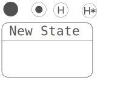
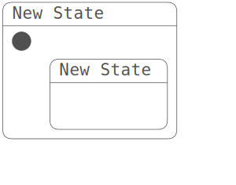
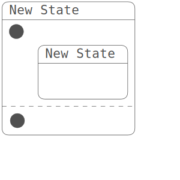
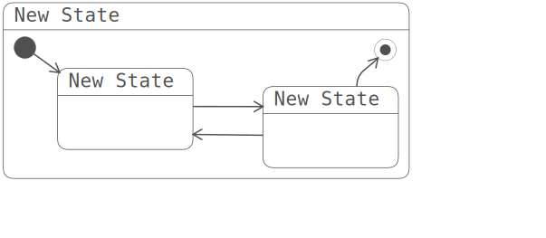
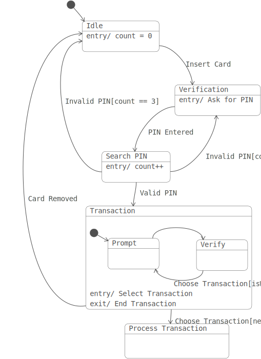
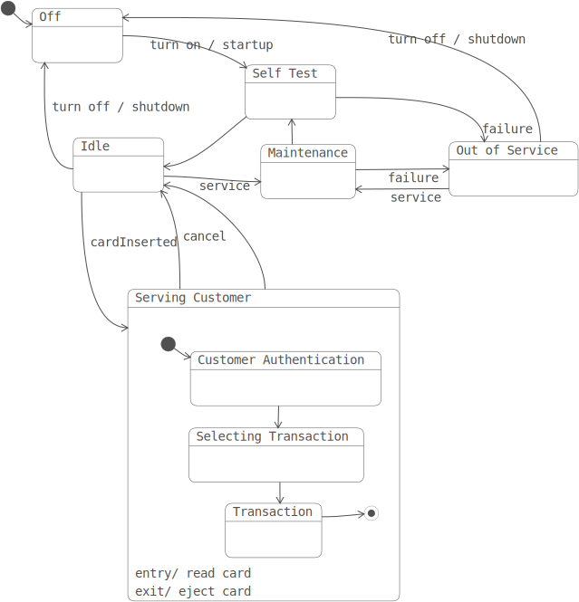
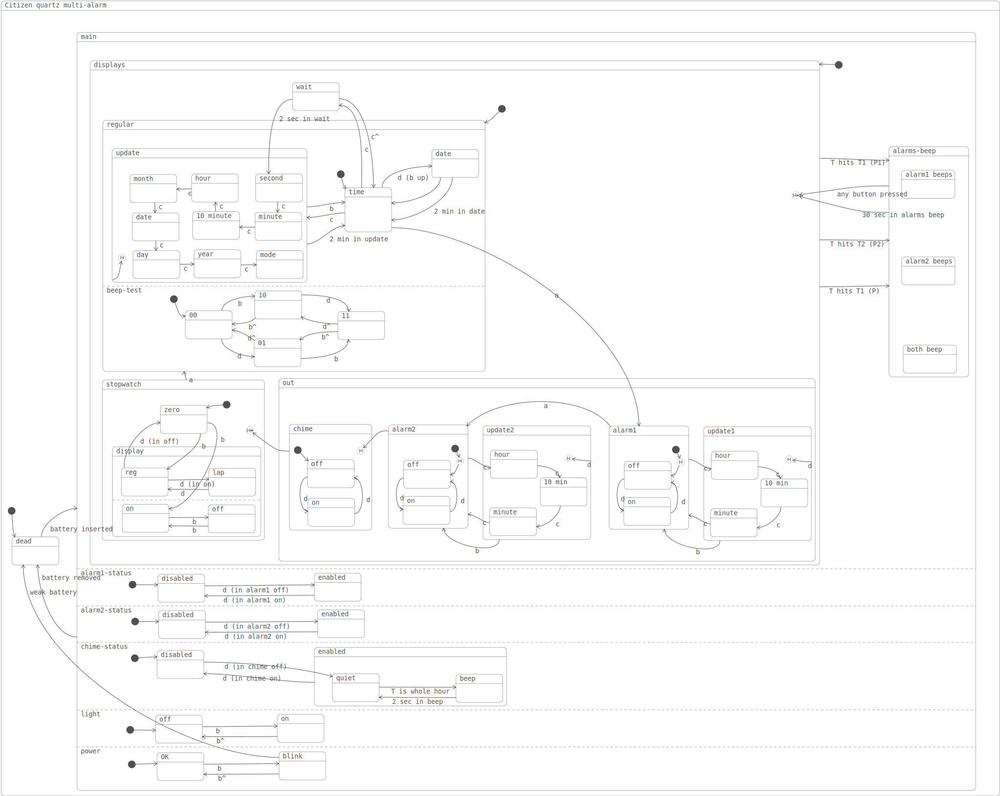

# Introduction
The Statecharts example implements a graphical editor for Statecharts. It aims to support most Statechart features with a simple, minimal user interface.

[Live Demo](https://billbudge.github.io/WebEditorFramework/examples/statecharts/)

# Statecharts
[Statecharts: a visual formalism for complex systems](https://www.sciencedirect.com/science/article/pii/0167642387900359) were invented by David Harel as a visual formalism for state machines. With states and transitions between them, Statecharts resemble finite state machines, but introduce two key new concepts.

1. States are hierarchical, so that a Statechart may be contained in a parent state. A transition from the parent state represents a transition from every contained state, which is a key abstraction mechanism, and greatly reduces the number of transitions needed in the diagram.

2. States may also contain multiple orthogonal Statecharts, which conceptually execute in parallel. This gives a product space of possible configurations of state, and greatly reduces the number of states  in the diagram.

# Getting Started
At the top left of the canvas area, a floating palette contains the states and pseudostates used to create a statechart. The top row of the palette contains the pseudo-states 'start', 'stop', 'shallow history', and 'deep history'. The bottom row contains a 'new state'.
<figure>
  
</figure>

Items in the palette can be dragged onto the empty canvas area, and onto any states that are on the canvas, in order to create superstates. Superstates are automatically laid out to entirely contain their child states. In addition, the editor allows states to be resized manually, by dragging the edges or corners of states.
<figure>
  
</figure>

There are rules for pseudostates, principally that the solid black 'start' pseudostate must be unique in a statechart, as there can be only one starting state. Dragging another start state onto the root statechart is immediately undone by the editor. However, adding another start state to a superstate causes a new statechart to be added to the state. This is the way to create parallel or concurrent statecharts in a superstate.
<figure>
  
</figure>

States and pseudostates on the canvas have an arrow shaped transition handle at their top right. These can be dragged and connected to other states, and even to the source state for a "self transition". Note that transitions have an arrow indicating the direction from source to destination. Transitions can be adjusetd at both the source and destination to make diagrams clearer. There are some restrictions on transitions involving pseudostates. A 'start' pseudostate can only be the source of a transition, while an 'end' pseudostate can only be the destination of a transition. Transitions are also not allowed between concurrent statecharts in the same superstate. The editor enforces these restrictions, and will remove illegal transitions if the user attempts to create them.
<figure>
  
</figure>

# Property Editing
While statecharts are mostly graphical, there are some properties associated with states and transitions
that are more properly edited as text or enumerations. When a state is selected, a property editor appears, exposing 'name', 'entry action', and 'exit action' controls. The name can be edited as pure text, while actions may be text or enumerations. Similarly, transitions have 'event', 'guard', and 'action' properties. Exactly how these properties are edited depends on the statechart template. TBD

# Selection
States and transitions can be selected by the user. The Shift and Control/Command keys can be used to extend the current selection. Control/Command 'a' will select all states and transitions on the canvas. Finally, Command/Control 'e' will extend the selected states to all connected states.

# Example Statecharts

A simplified Statechart for a bank ATM.
<figure>
  
</figure>

Another simplified Statechart for a bank ATM.
<figure>
  
</figure>

As a stress test, the full Citizen Quart Multi-Alarm Statechart from Harel's paper. In the paper, the concurrent superstates can have sub-statecharts laid out horizontally as well as vertically. This editor currently only supports vertical layout, so the diagram looks different, though the statechart represents the same behaviors.
<figure>
  
</figure>

